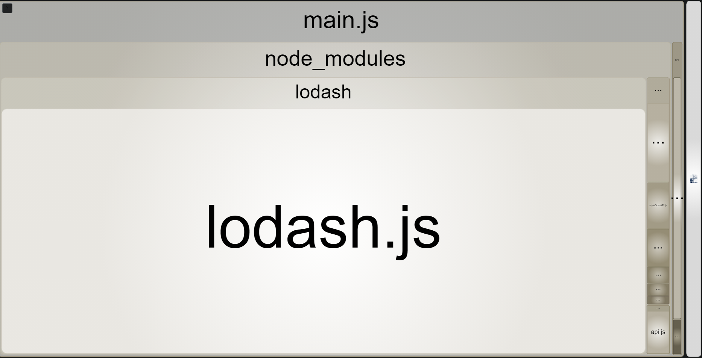

# Webpack

- [**Notes**](#webpack---notes)
- [**Resources**](#webpack---resources)

## Module bundlers

A module bundler is a tool that takes pieces of JavaScript and their dependencies and bundles them into a single file.

A website is built using multiple tools.
For example, JavaScript, HTML, CSS would be considered the bare minimum.
However, things are a lot more complicated nowadays for a complete website to be built and many languages, tools and libraries are usually needed. To combine them all for optimization and to make sure they all work together is a difficult task. That's where Module bundlers come in.

A module bundler, basically, bundles all the assets used together.

## Webpack - Notes

For test,

- Create a project and make a file ***index.js*** inside a folder ***src***
- Open a terminal in that project's folder and type

      npm init -y
  to create a ***package.json*** file
- Install a module for testing

      npm i lodash
- Create a folder ***public*** inside the project's folder and create ***index.html*** file inside this folder and paste

      <!DOCTYPE html>
      <html>
          <head>
              <meta charset="utf-8">
              <meta name="viewport" content="width=device-width, initial-scale=1.0">
              <title>Document</title>

              
          </head>
          <body>

          </body>
      </html>
- Inside the ***index.js*** file, paste

      import { camelCase } from 'lodash';

      console.log(camelCase('hello world'));

If you open ***index.html*** with a browser and head to the console, you'll notice an error.

- Open a terminal in the project's folder and type

      npm i --save-dev webpack-cli webpack
  to install ***Webpack***
- Open the ***package.json*** file and paste

      "build": "webpack"
  inside the *"scripts"* section
- Open a terminal in the project's folder and type

      npm run build
  to compile our code
- Now, inside the ***index.html***, change the script src attribute like so

      

If you head back to the browser and open the console, you will see a '***helloWorld***' being printed successfully.

It is very important to know that ***Webpack*** is currently using the **DEFAULT** configuration which means that it is specifically looking for the ***index.js*** file inside the ***src*** folder. However, in some cases, you will want/need to configure ***Webpack*** yourself.

- Create a ***webpack.config.js*** file inside our project's folder and paste

      module.exports = {
        entry: './src/index.js',
      };
  Notice, to include many entry points (this is called **CODE SPLITTING**) you need

      module.exports = {
        entry: {
          foo: 'foo.js',
          bar: 'bar.js'
        },
      };
  More options, for example, **output**

      const path = require('path');

      module.exports = {
        entry: './src/index.js',
        output: {
          filename: 'awesome.js',
          path: path.resolve(__dirname, 'dist'),
        },
      };

### Include SASS

- Inside the ***src*** folder, create a file ***style.scss*** and paste your desired or even random ***SCSS*** code

      $text: orange;
      $bg: black;

      body {
        color: $text;
        background: $bg;
      }
- Include it in the ***index.js*** file

      import './style.scss';

Now, notice that if you try to build with

    npm run build
an error will occure. That's because we do not have a loader for our ***SASS***.

To solve this, simply open a terminal in the project's folder and type

    npm install --save-dev css-loader style-loader sass-loader sass

- Include the modules in the ***webpack.config.js*** file, inside the *"module.exports"* section. The end result should look like this

      const path = require('path');

      module.exports = {
          entry: './src/index.js',
          output: {
              filename: 'main.js',
              path: path.resolve(__dirname, 'dist'),
          },
          module: {
              rules: [
                  {
                      test: /\.scss$/,
                      use: [
                          'style-loader',
                          'css-loader',
                          'sass-loader',
                      ],
                  },
              ],
          },
      };

### Analyze bundle (using plugins)

- Open a terminal in the project's folder and type

      npm install --save-dev webpack-bundle-analyzer
- Paste

      const BundleAnalyzerPlugin = require('webpack-bundle-analyzer').BundleAnalyzerPlugin;
  in the ***webpack.config.js*** file, outside of the *"module.exports"* section and

      plugins: [
        new BundleAnalyzerPlugin()
      ],
  inside the section.
- When you build, you should see this screen

  

### Setup local web server

- Open a terminal in the project's folder and type

      npm install --save-dev webpack-dev-server
- In the ***webpack.config.js*** file, outside of the *"module.exports"* section, paste

      devServer: {
        contentBase: path.join(__dirname, 'public'),
        port: 9000
      },
- Open the ***package.json*** file and paste

      "dev": "webpack serve"
  inside the *"scripts"* section
- Start server by typing

      npm run dev
  inside the terminal

## Webpack - Resources

- [Fireship video](https://youtu.be/5IG4UmULyoA)
- [webpack-bundle-analyzer documentation](https://www.npmjs.com/package/webpack-bundle-analyzer)

[HOME](https://github.com/Stratis-Dermanoutsos/Full-Stack-2021#full-stack-roadmap-2021) or [Back to top](#webpack)
